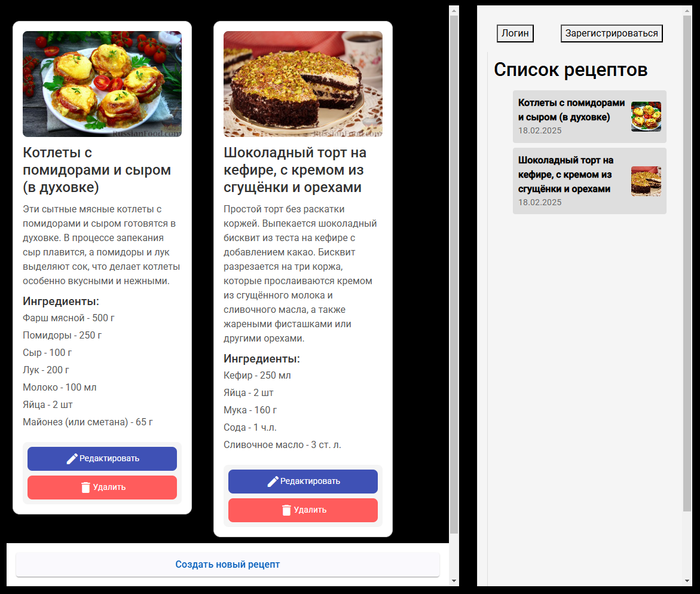

# Кулинарный сайт на Angular

Это приложение позволяет создавать, редактировать, отображать и удалять рецепты. Оно реализовано с использованием **Angular** и использует **Angular Material** для оформления интерфейса. Приложение также поддерживает модальные окна для логина и регистрации пользователей.

## Описание функционала

### Реализованные CRUD операции:

1. **Create (Добавление нового рецепта)**:
   - Пользователь может создать новый рецепт, заполнив форму с названием, описанием и ингредиентами.
2. **Read (Отображение списка рецептов и деталей рецепта)**:
   - Все рецепты отображаются в списке. Кликнув на рецепт, пользователь может увидеть его подробное описание, включая ингредиенты.
3. **Update (Редактирование существующего рецепта)**:
   - Пользователь может отредактировать уже существующие рецепты, изменяя название, описание и ингредиенты.
4. **Delete (Удаление рецепта)**:
   - Пользователь может удалить рецепт из списка, и он сразу исчезает из интерфейса.

## Технологии

- **Angular 15+**
- **Angular Material** для создания красивых интерфейсов и модальных окон.
- **Reactive Forms** для валидации и обработки форм.
- **localStorage** для хранения данных рецептов на клиентской стороне.

## Скриншоты



## Установка

```bash
npm install
```
